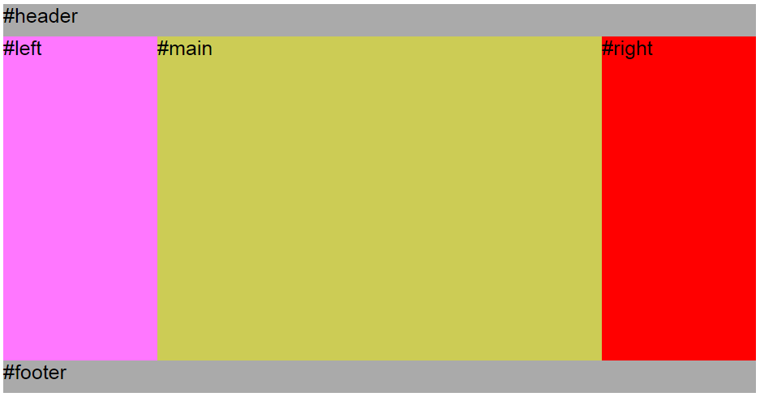
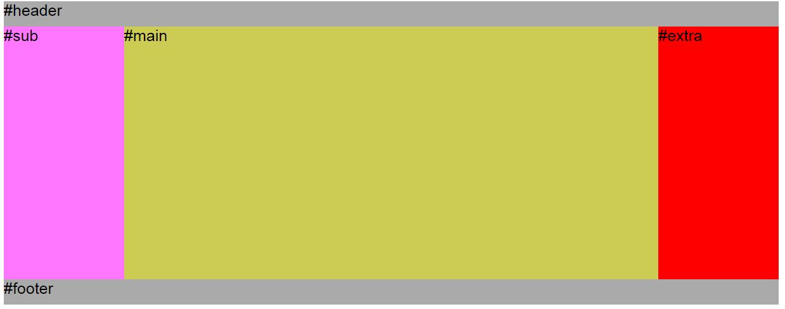
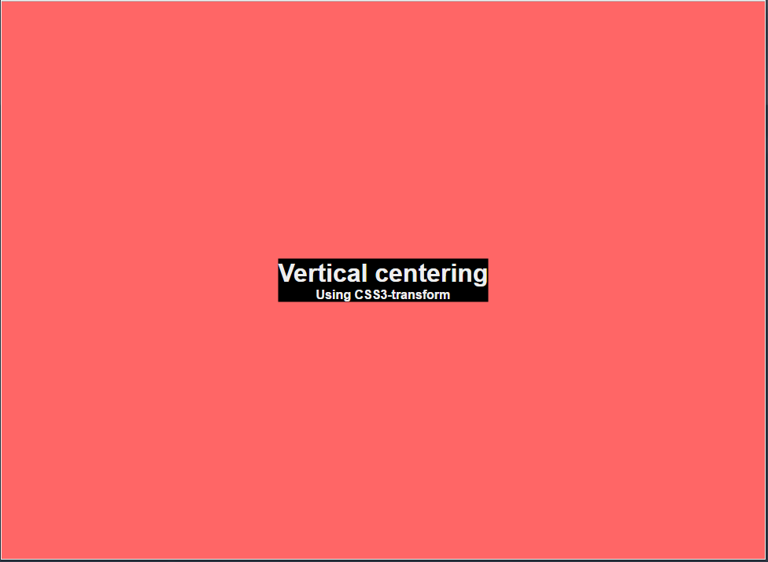

# layout Collection
收集常用的页面布局的各种实现

## 圣杯布局

* 使用传统的浮动来实现，其中，main，left和right先后在container容器中
* main占据全部的width，left和right的width是固定的，给容器增加padding来使main的内容不被left和right遮盖
* left因为浮动原因会换行，这是，只要使用**margin-left:-100%**就可以使left回缩到main这一行的开始，而right则使用margin-left的负值，大小为自己的width，即可退缩到main这一行的右边。
* 对于容器container，需要清除浮动，可以使用伪类after的**clear:both**来清除浮动。

## 双飞翼布局

* 双飞翼布局与圣杯布局的目的是一致的，但是双飞翼布局相比于圣杯布局有着更佳的体验，具体如下：
  1. 没有采用绝对定位，提升了性能和兼容性
  2. 对于main使用了两层结构，使得main成为了BFC，而main-wrap作为承载内容的主体，可以避免在屏幕极小的情况下塌陷

## 垂直居中布局

垂直居中布局经常用于展示特定内容以及作为首页使用。布局的要点如下：

* 父元素为body，实现相对于页面的垂直居中
* 绝对定位布局，left和top均为50%
* 在上一步实现之后，会因为自身元素的大小而又一定的偏移，如果是大小固定的，则比较好操作，如果是大小不固定了，那么就需要使用transform来进行偏移